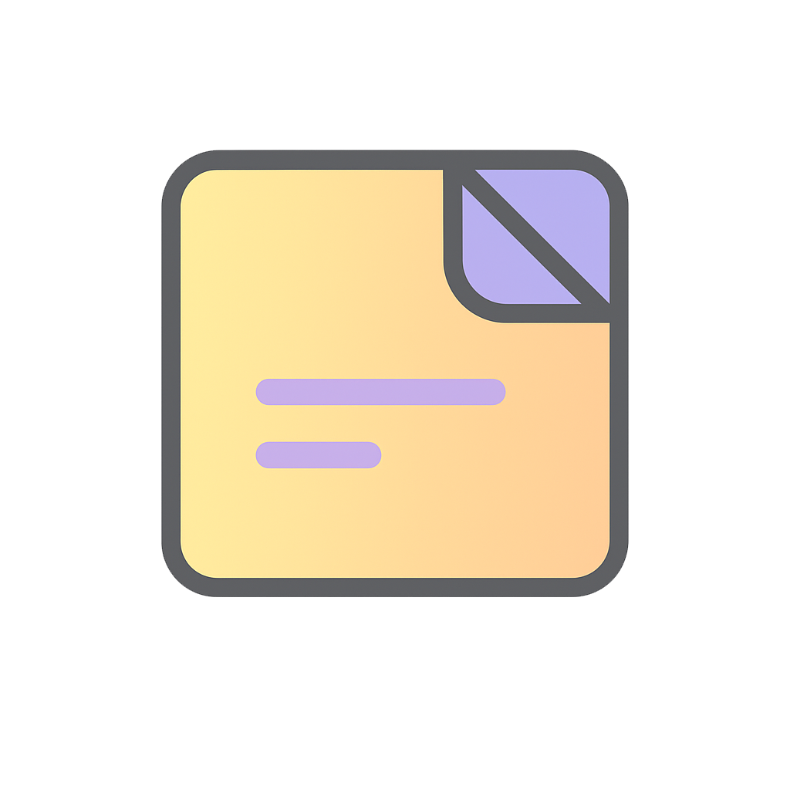

# Simple Keep

**Simple&nbsp;Keep** is a lightweight, client‑side note‑taking app inspired by Google Keep.  It runs entirely in your browser and requires no back‑end services, making it ideal for hosting on static site platforms.

---

## Features

- **Notes and checklists:** Create plain text notes or switch to checklist mode to add tasks with inline checkboxes.
- **Drag and drop reordering:** Use the grip handle on any note to rearrange your pinned and unpinned notes.
- **Pinned & coloured notes:** Organise visually with custom note colours; pin important notes to keep them at the top.
- **Modern icons:** Built with Bootstrap Icons for a crisp, contemporary look.
- **Dark & light themes:** Toggle between light and dark modes; your preference is saved locally.
- **Gradient note input:** The note creation area features a subtle colour gradient border for a touch of personality.
- **Edit, delete and search:** Quickly update content or filter your notes with instant search.
- **Offline support:** Works entirely in the browser with localStorage persistence.
- **Import/export:** Back up and restore notes using a JSON file.
- **Zero‑cost hosting:** Deploy as a static site—no server required.

---

## Getting Started

### Run locally

1. Download or clone this repository.
2. Open `index.html` in your browser.

That's it; everything runs client‑side.

---

## Deployment

### Deploy to Azure Static Web Apps

You can host Simple&nbsp;Keep as a static site:

1. Create a new [Azure Static Web App](https://portal.azure.com/).
2. Point it at this repository or upload the contents of the `src` folder.
3. Set the build output location to `/src`.
4. (Optional) Enable authentication with Azure AD or GitHub to secure access.

### Other Hosting Options

- GitHub Pages
- Netlify
- Vercel
- Any S3‑compatible bucket

---

## User Storage

Simple&nbsp;Keep provides two buttons in the header:

- **Export Notes**: Saves your notes as a `.json` file.
- **Import Notes**: Restores from a previously exported file.

This allows users to manage their own data using cloud drives (e.g. upload the exported file to Google Drive or OneDrive) without the need for server‑side databases.

---

## Customisation Ideas

- Replace `localStorage` with IndexedDB for more robust offline support.
- Integrate with OAuth + Microsoft Graph or Google Drive for user‑authenticated storage.
- Enable PWA functionality with a service worker and manifest.
- Add collaboration features or note sharing capabilities.

---

## License

MIT — free for personal or commercial use.